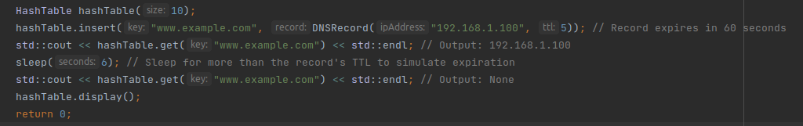
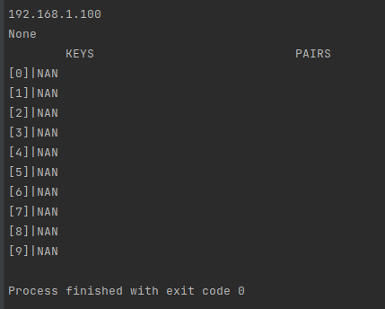
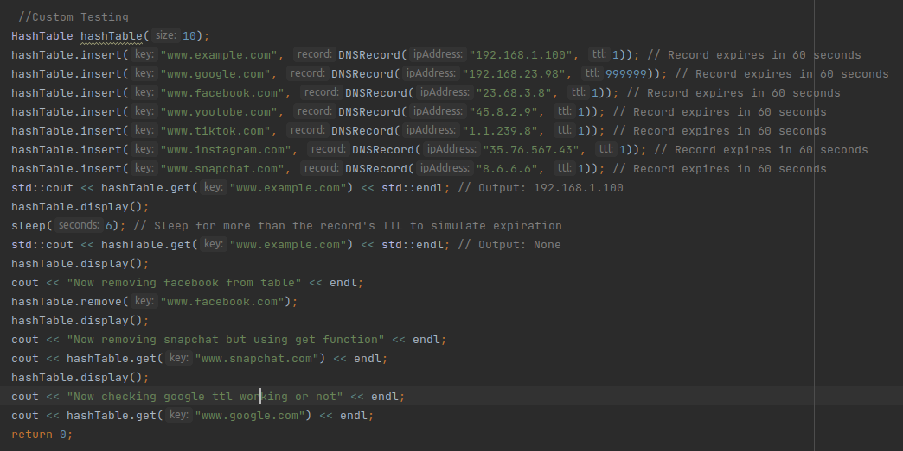
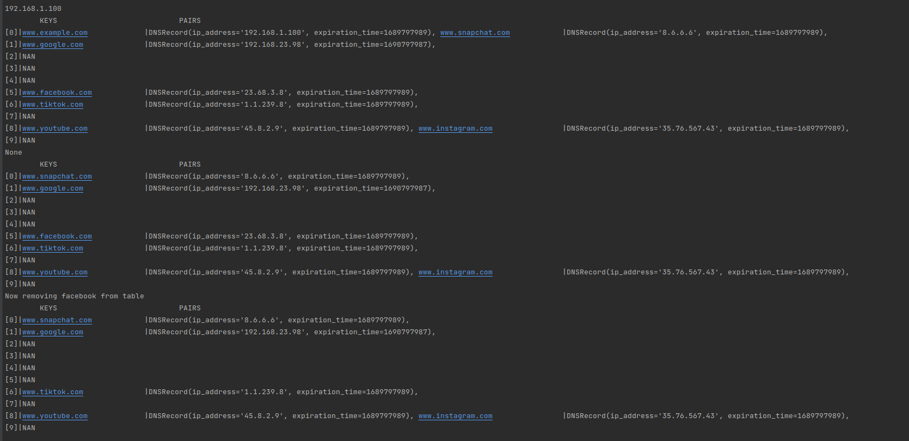

# DNS CACHE Project

## Project Description: DNS Cache using Hash Table
**This project implements a DNS (Domain Name System) cache using a hash table
data structure in C++. The DNS cache is a crucial component of networking systems
as it stores recently resolved domain names and their corresponding IP addresses,
enabling faster future lookups.
The project consists of the following components:**

_Hash Table: The hash table is the core data structure used to store the DNS
cache. It is implemented as an array of linked lists. Each bucket in the
hash table represents a linked list of key-value pairs, where the key is
the domain name, and the value is the associated IP address and expiration
time.
DNSRecord: The DNSRecord class represents a record in the DNS cache. It
contains the IP address and expiration time of the record. The expiration
time is set based on the TTL (Time-to-Live) value received from the DNS
server. The DNSRecord class also provides a method to check if a record has
expired.
Node: The Node class represents a node in the linked list within each
bucket of the hash table. Each node holds a key-value pair, where the key
is the domain name, and the value is a DNSRecord object.
Hash Function: A hash function is used to map the domain name keys to an
index in the hash table. In this project, a custom hash function based on
the std::hash is employed._

## **The project allows the following functionalities:**

Insertion: The project enables the insertion of domain name and IP address
pairs into the DNS cache. Each entry includes an expiration time (TTL)
received from the DNS server.
Lookup: The project supports looking up IP addresses based on the domain
name. If a requested domain name is found in the DNS cache and has not
expired, the corresponding IP address is returned. Otherwise, if the entry
has expired or is not present, "None" is returned.
Expiration: The project automatically removes expired entries from the DNS
cache when they are looked up or accessed. This ensures that only valid and
up-to-date entries are stored in the cache.
Display: The project provides a display function to show the contents of
the hash table, including the linked list within each bucket. This
facilitates understanding and monitoring the DNS cache.

### The project is organized into multiple files, including main.cpp, HashTable.h, HashTable.cpp, DNSRecord.h, DNSRecord.cpp, Node.h, and Node.cpp. The Makefile is also provided to compile the project. By implementing this DNS cache using a hash table, the project demonstrates an efficient approach to store and retrieve frequently accessed domain names and their corresponding IP addresses, reducing the need for frequent DNS lookups.

---
## Files
1. main.cpp (_contains driver code_)
2. Node.h
3. Node.cpp
4. HashTable.h
5. HashTable.cpp
6. DNSRecord.h
7. DNSRecord.cpp
8. readme.md

---
## IMAGES

---
### Driver Code

---
### OUTPUT

---
### Custom Testing Code

---
### OUTPUT

***
# _THE END._
